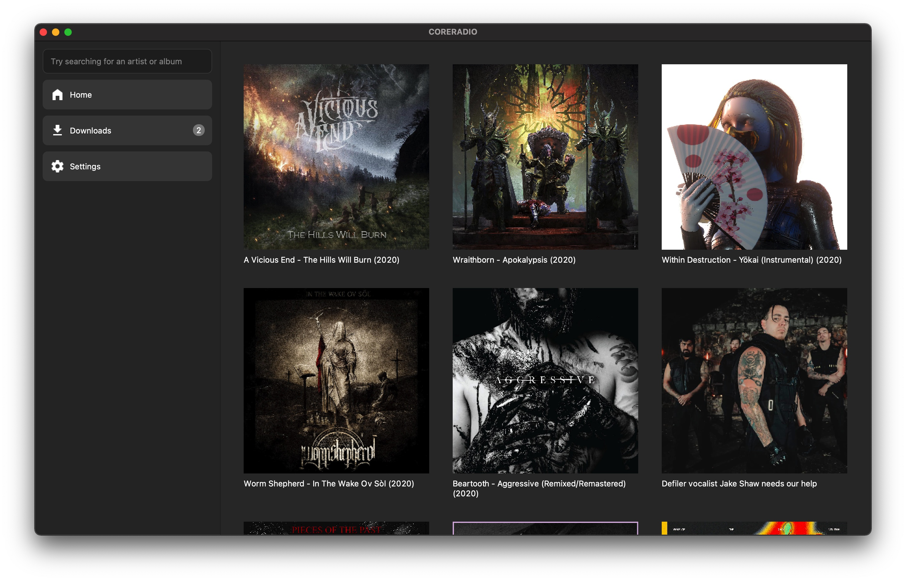
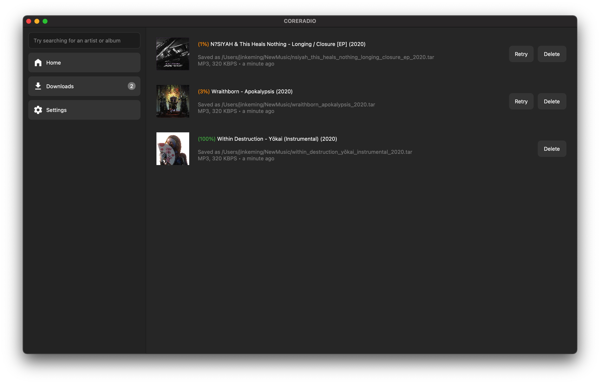

# Coreradio Desktop

# Installation

- `git clone https://www.github.com/kkoomen/coreradio-desktop.git`
- `cd coreradio-desktop`
- `python3 -m venv env`
- `source ./env/bin/activate`
- `pip3 install -r requirements.txt`
